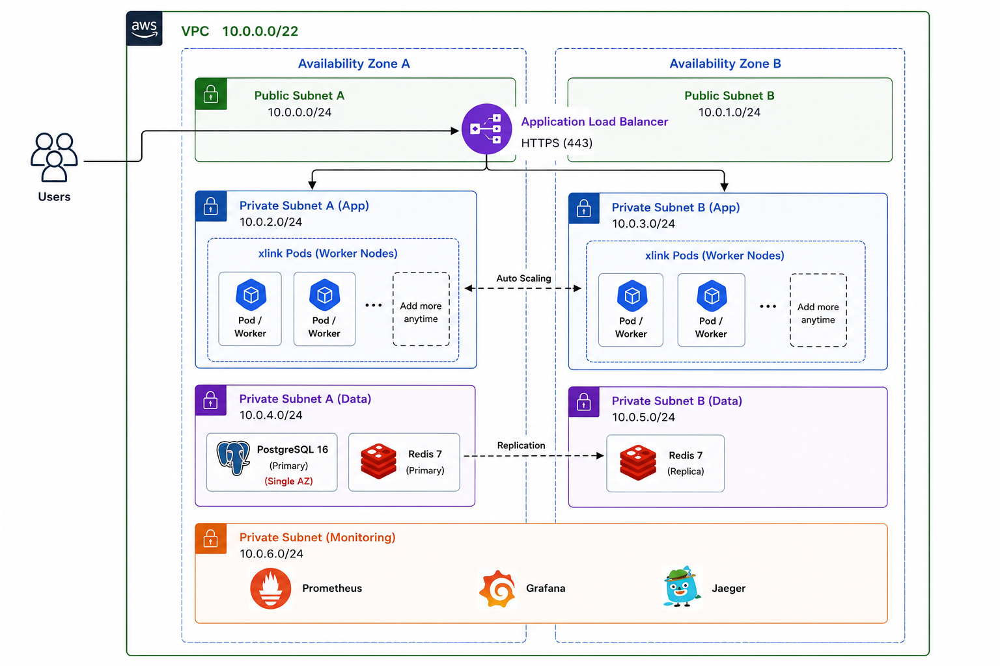

# xlink

A fast, efficient and scalable URL shortener written in Go.

## Architecture



## Features

- **Multi-Tier Caching**: In-memory L1 cache (TinyLFU via Ristretto) and L2 cache (Redis) for fast redirects.
- **SingleFlight Coalescing**: Prevents cache stampedes on concurrent requests.
- **Asynchronous Click Analytics**: Ingests visitor metadata into Redis Streams and processes batches in the background into PostgreSQL.
- **Analytics API**: Query click counts over time, unique visitors, and country, device, browser, OS, and referrer breakdowns.
- **Observability**: Prometheus metrics (`/metrics`), OpenTelemetry tracing (Jaeger), and `/livez` and `/readyz` health endpoints.
- **Authentication**: JWT access and refresh token management with secure hashing.

## Performance

Tested on 3× c6g.large instances behind an AWS ALB with kernel and Nginx tuning applied.

| Metric | Value |
| :--- | :--- |
| Sustained Throughput | 50,000+ req/s |
| p50 Redirect Latency | ~1–2ms |
| p95 Redirect Latency | <10ms |
| p99 Redirect Latency | <50ms |
| Direct Cache Hit | sub-millisecond |

---

## API Reference

### Authentication

| Method | Endpoint | Description |
| :--- | :--- | :--- |
| `POST` | `/api/v1/auth/register` | Register a new account |
| `POST` | `/api/v1/auth/login` | Log in and receive access + refresh tokens |
| `POST` | `/api/v1/auth/refresh` | Obtain a new access token using a refresh token |
| `POST` | `/api/v1/auth/logout` | Revoke a refresh token |

### URL Management (Requires Bearer Token)

| Method | Endpoint | Description |
| :--- | :--- | :--- |
| `POST` | `/api/v1/urls` | Create a short URL |
| `GET` | `/api/v1/urls/:shortCode` | Get details for a short URL |
| `PATCH` | `/api/v1/urls/:shortCode` | Update destination URL, alias, or expiration |
| `DELETE` | `/api/v1/urls/:shortCode` | Delete a short URL |

### Analytics (Requires Bearer Token)

| Method | Endpoint | Description |
| :--- | :--- | :--- |
| `GET` | `/api/v1/urls/:shortCode/analytics` | Get aggregated visitor statistics |

**Query Parameters:**
- `interval`: `hour` or `day` (default: `day`)
- `from`: Start timestamp (e.g. `2026-08-01T00:00:00Z`)
- `to`: End timestamp (e.g. `2026-08-29T00:00:00Z`)

### Public Redirect

| Method | Endpoint | Description |
| :--- | :--- | :--- |
| `GET` | `/:shortCode` | Redirects to destination URL (`302 Found`) |

---

## Quick Start (Local Setup)

### Using Docker Compose

```bash
git clone https://github.com/mohdrashid9678/xlink.git
cd xlink

docker compose up -d --build
```

- **API**: `http://localhost:8080`
- **Jaeger UI**: `http://localhost:16686`
- **Metrics**: `http://localhost:8080/metrics`
- **Health Check**: `http://localhost:8080/readyz`

### Running Directly on Host

1. Ensure Go 1.26+, PostgreSQL 16, and Redis 7 are running.
2. Configure your environment variables in `.env`.
3. Start the application:
   ```bash
   go run ./cmd/api
   ```

---

## Production Deployment Scripts

The `deploy/` directory contains standalone setup scripts for Ubuntu:

```
deploy/
├── setup-server.sh      # Sets up App server (kernel tuning, Nginx, and systemd service)
├── setup-db.sh          # Sets up PostgreSQL 16 and applies schema migrations
├── setup-redis.sh       # Sets up Redis 7 with LRU memory caching
└── setup-monitoring.sh  # Sets up Prometheus, Grafana, and Jaeger
```

To run any script:
```bash
chmod +x deploy/setup-server.sh
./deploy/setup-server.sh
```

---

## Future Roadmap

- [ ] **Distributed Rate Limiting**: Sliding-window rate limiter with Redis.
- [ ] **URL Safety Verification**: Automated check for malicious destinations.
- [ ] **Webhook Notifications**: Webhook delivery for click events.
- [ ] **API Key Management**: Programmatic API keys with custom permissions.
- [ ] **Background Cleanup Worker**: Periodic cleanup of expired URLs and revoked tokens.

---

## Contributing

1. Create your feature branch (`git checkout -b feature/my-feature`).
2. Verify that all tests pass:
   ```bash
   go test -v -race ./...
   ```
3. Open a pull request.

---
